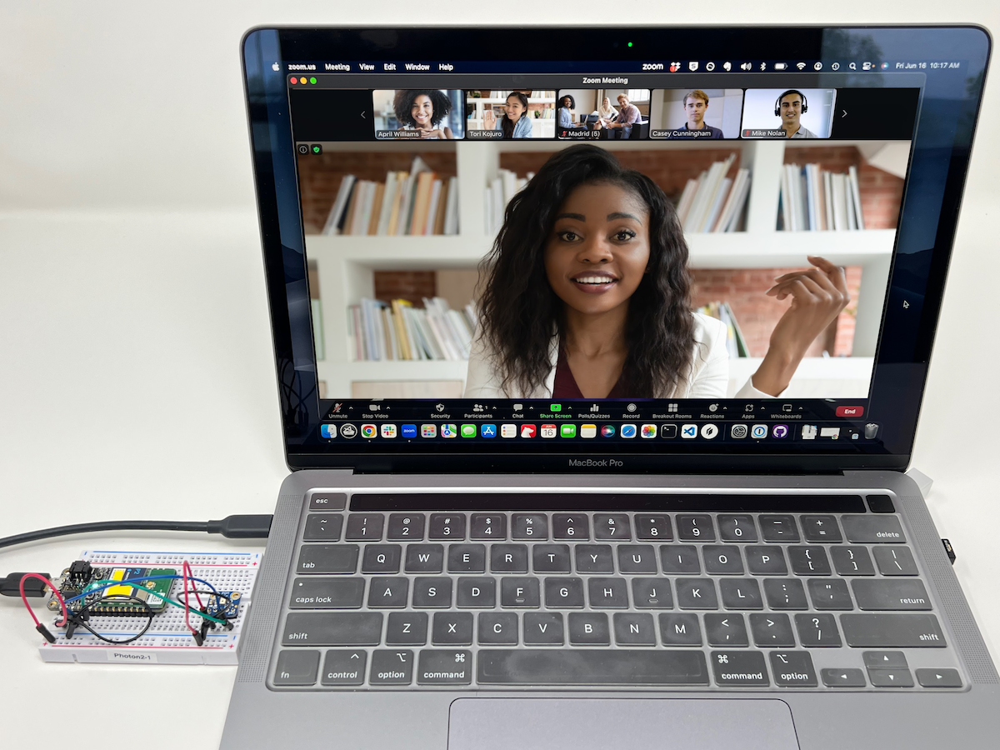
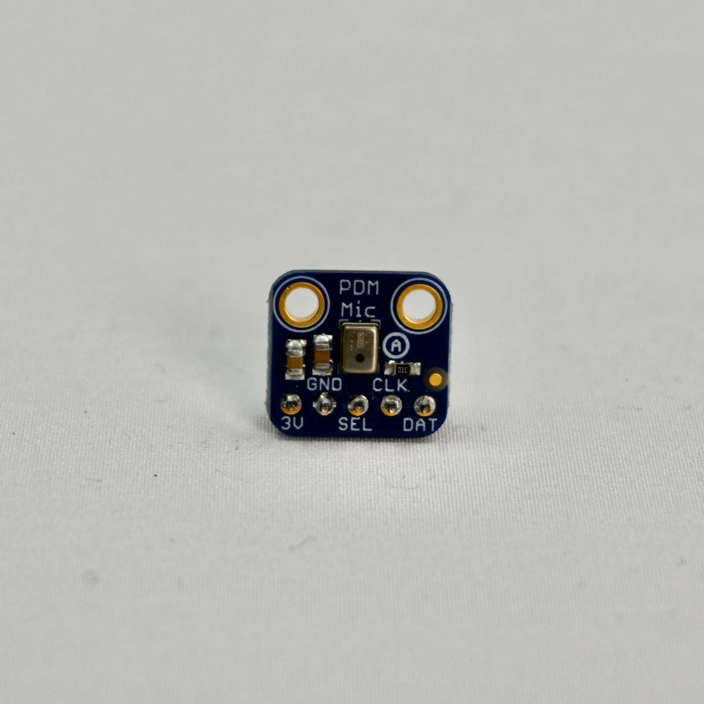
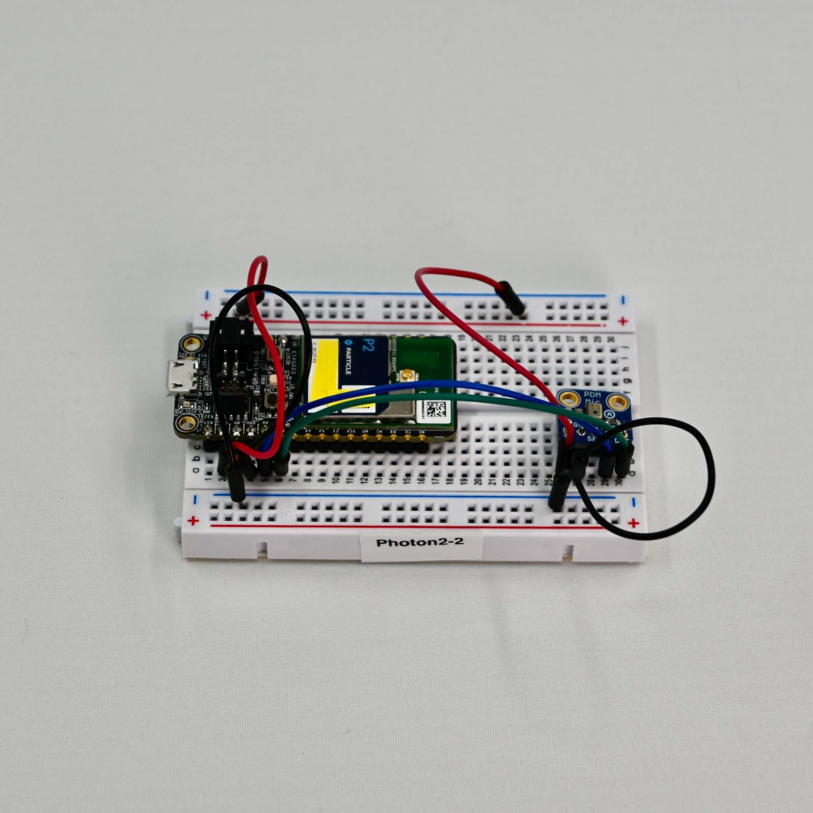
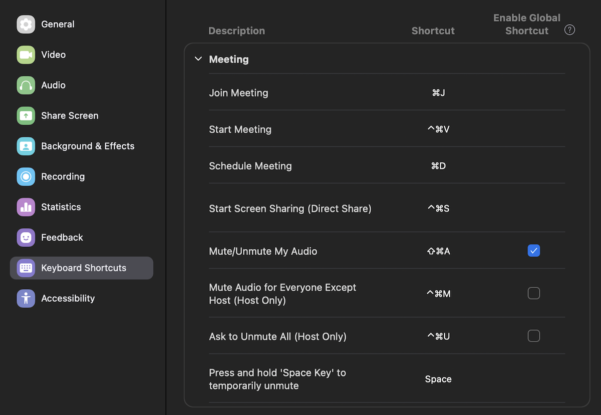
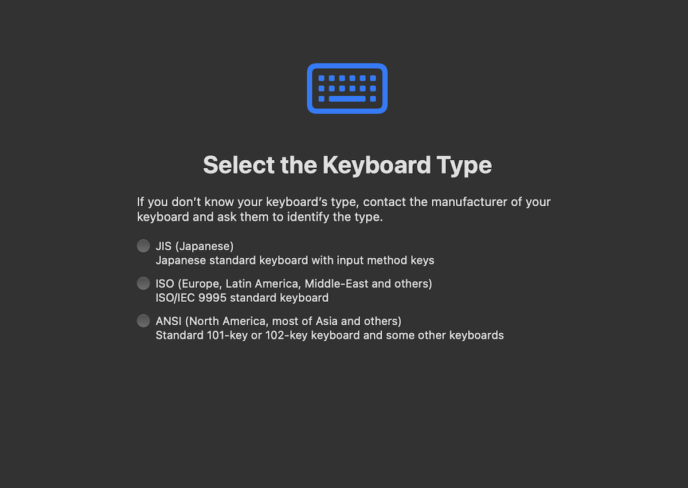

# make-magazine-muted-demo

*Particle "You're Muted" detector using microphone and Edge Impulse Edge ML*




This detector is trained to recognize the phrase "You're muted" and generate a keystroke to unmute your Zoom session. 

## Wiring the microphone

You will need the following hardware, included in the [Edge ML Kit](https://docs.particle.io/reference/datasheets/accessories/edge-ml-kit/)

- PDM digital microphone
- Photon 2 (included with the Edge ML Kit)



The connections on the breakout are:

| Breakout | Color | Connect To | Details |
| :---: | :--- | :---: | :--- |
| 3V | Red | 3V3 | 3.3V power |
| GND | Black | GND | Ground |
| SEL | | NC | Typically leave unconnected, left/right select |
| CLK | Blue | A0 | PDM Clock |
| DAT | Green | A1 | PDM Data |

The pinout for the Photon 2 can be found on its [datasheet](https://docs.particle.io/reference/datasheets/wi-fi/photon-2-datasheet/#pin-markings).



## Configure Zoom

Open the Settings in Zoom. Then select Keyboard Shortcuts. Find **Mute/Unmute my Audio**. Note the key sequence, and you will probably want to check the box for Enable Global Shortcut. The default is typically Command-Shift-A on the Mac and Alt-A on Windows.



If using a global shortcut, on the Mac, you may be asked to enable accessibility features. In the Control Panel, it's in Privacy & Security, Accessibility, and make sure the slider is set to on for zoom.

The first time you connect the Photon 2 running this firmware on the Mac, you may be prompted to select the keyboard type. Select ANSI.



## Install Particle Workbench

If you have not already done so, install [Particle Workbench](https://docs.particle.io/workbench/), the integrated development for Particle devices for Windows, Linux, and Mac.

For a new install be sure to log into your Particle account. From the command palette (Ctrl-Shift-P on Windows and Linux or Cmd-Shift-P on Mac). Select **Particle: Login**.

## Running pre-built demos

The easiest way to get started is to download [this repository](https://github.com/particle-iot/make-magazine-muted-demo) from Github, using your favorite Github client or downloading and extracting the .zip file.

- Open `make-magazine-muted-demo` using the **File > Open Folder...** option in Particle Workbench (VS Code).
- Open a command line prompt from the command palette (Ctrl-Shift-P on Windows and Linux or Cmd-Shift-P on Mac). Select **Particle: Launch CLI**.
- Flash the prebuilt binary to your device. 

For Windows or Linux (Alt-A is the mute key):

```
particle flash MyPhoton firmware-win.bin
```

For Mac (Command-Shift-A is the mute key):

```
particle flash MyPhoton firmware-mac.bin
```

Replace "MyPhoton" with the name of your device. If you aren't sure what you named it, use `particle list`.


## Building the software

To build your own binary:

- Use **Particle: Configure Project For Device** and select **deviceOS@5.5.0** and **P2**. The P2 option is also used for the Photon 2. Device OS 5.4.1 or later is required for this demo.
- In src/main.cpp, you'll need to configure the keyboard shortcut to what was set above. 

```cpp
// Keyboard.click(KEY_A, MOD_LEFT_COMMAND | MOD_LSHIFT); // Mac
Keyboard.click(KEY_A, MOD_LALT); // Windows                
```

- Use **Particle: Cloud Flash** to compile and flash the code to your device.

## Learn more

- Visit the [Particle Machine Learning Page](https://docs.particle.io/getting-started/machine-learning/machine-learning/) for more examples.
- You can find additional projects on the [Edge Impulse ML projects page](https://www.edgeimpulse.com/projects/all?search=particle).
- Learn how to create your own projects in the [Edge Impulse documentation](https://docs.edgeimpulse.com/docs).
